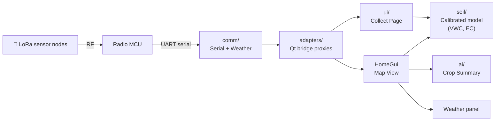

<div align="center">

# SoilSense Monitor

**PyQt6 desktop app for soil-moisture sensor data collection and AI-assisted agronomic analysis**

<p>
  <a href="https://github.com/mingqianghan/SoilSense-Monitor/releases/latest"></a>
  
  
  <a href="https://github.com/mingqianghan/SoilSense-Monitor/releases"></a>
</p>

</div>

---

A PyQt6 desktop application for collecting and analyzing data from
distributed soil sensor nodes. Talks to a custom LoRa (Long Range) radio
microcontroller (MCU) over UART serial, plots the sensor's
frequency-response curves in real time, and runs a calibrated model to
estimate volumetric water content (VWC), bulk **EC** (electrical
conductivity), and pore EC per node.

The app pairs an interactive **Map View** (with weather panel and AI
agronomic summaries) with a **Collect Page** (serial port setup,
collection workflow, frequency-response plot, and serial log).

> **Version note.** This is an improved, restructured version of the
> original software. The earlier version remains available for reference at
> [this repo](https://github.com/mingqianghan/SoilSensorFirmwareAndInterface).
> The two repositories share the same hardware/firmware foundation;
> this one adds a redesigned PyQt6 UI, AI-assisted agronomic summaries, and real-time soil models.

## 🎬 Demo

**Map View page**


**Collect Data page**


## 📥 Download (Windows)

Pre-built Windows binary — no Python installation needed.

1. Download **[SoilSenseMonitor-v1.0.1-win64.zip](https://github.com/mingqianghan/SoilSense-Monitor/releases/latest)** from the latest release (~394 MB).
2. Extract anywhere (Downloads, Desktop, etc.).
3. Run `SoilSenseMonitor\SoilSenseMonitor.exe`.

On first launch you'll be prompted for API keys (all optional — see
[API keys](#-api-keys) below). Prefer to run from source? See
[Quick start](#-quick-start).

## ✨ Features

- **Per-node soil-property estimation** — VWC, bulk EC, pore EC, and
  USDA (U.S. Department of Agriculture) salinity class, derived from a
  calibrated model.
- **Field map** with sensor pins, plot polygons, and weather forecast.
  Online via Leaflet + Google satellite tiles.
- **AI Crop Summary** — one-shot agronomic report from current sensor +
  weather data, via your choice of Claude / GPT / Gemini.
- **Per-user API key storage** in the OS credential store (Windows
  Credential Manager / macOS Keychain / Linux Secret Service).
- **Light + dark themes**.

## 💻 Requirements

| Mode                 | Requirements                                                                    |
| -------------------- | ------------------------------------------------------------------------------- |
| **Pre-built `.exe`** | Windows 10 / 11 (64-bit)                                                        |
| **From source**      | Python 3.10+, Windows / macOS / Linux                                           |
| **Live capture**     | USB serial connection to the LoRa receiver MCU; historical-only mode needs none |

## 🚀 Quick start

```bash
# 1. Install Python dependencies
pip install -r requirements.txt

# 2. Run the app
python AppMain.py
```

On first launch you'll be prompted to configure API keys for the AI
provider and OpenWeather. **All keys are optional** — skip and the app
runs with limited functionality; configure them later via the gear
buttons in the UI.

## ⚙️ Configuration

`config.json` at the project root defines the field markers, plot
polygons, and data folder paths. Edit it directly to point at your own
sensor nodes:

```jsonc
{
  "data_root": "data\\UG nodes",   // where to READ historical data
  "save_root": "data\\UG nodes",   // where to WRITE new collections
  "field": {
    "name":     "KSU Research Field",
    "location": "Manhattan, KS",
    "crop":     "Maize",
    "variety":  "P13050",
    "season":   "2026"
  },
  "markers": [ { "name": "S1", "latitude": …, "longitude": … }, … ],
  "plots":   [ { "name": "PD1", "planting_date": "…", "nodes": […],
                 "corners": [ … ] }, … ]
}
```

## 🔑 API keys

The app uses two external APIs. Each end-user supplies their own key:

| Service                                                         | Free tier                     | Used for                   | Sign-up                                                                        |
| --------------------------------------------------------------- | ----------------------------- | -------------------------- | ------------------------------------------------------------------------------ |
| **OpenWeather** (One Call 3.0)                                  | ~1,000 calls/day              | Weather panel + AI summary | [openweathermap.org/api/one-call-3](https://openweathermap.org/api/one-call-3) |
| **Anthropic Claude** _or_ **OpenAI GPT** _or_ **Google Gemini** | varies — Gemini Flash is free | AI Crop Summary            | see provider docs                                                              |

> First-time OpenWeather users must subscribe to the
> **"All-in-one Weather API"** plan (One Call 3.0) before generating a key.

Keys are stored in your OS credential store via the `keyring` library —
**never written to disk in plain text** and never shipped with the app.

## 🏗️ Architecture



The `comm/` layer reuses the original Tkinter-era serial controller
unchanged; the `adapters/` package bridges its callbacks into Qt
signals so the rest of the UI is pure PyQt6.

## 📂 Project layout

```
CommInterface_V2/
├── AppMain.py              # entry point
├── AppRoot.py              # main window + theme + tooltip system
├── HomeGui.py              # Map View page + weather panel
├── styles.py               # light + dark QSS
├── config.json             # field markers, plots, data paths
├── requirements.txt        # Python dependencies
├── result.pkl              # calibrated soil model (binary)
├── build.bat               # PyInstaller build script (Windows)
├── SoilSense.spec          # PyInstaller spec
│
├── comm/                   # UART + weather API clients (do not edit)
│   ├── serial_com_ctrl.py
│   ├── data_com_ctrl.py
│   └── weather_summary.py
│
├── ui/                     # Collect-page widgets
│   ├── CommCollectPage.py
│   ├── ComPanel.py
│   ├── DataCollectPanel.py
│   ├── LogPanel.py
│   ├── PlotPanel.py
│   └── SoilPropertiesPanel.py
│
├── adapters/               # Tkinter→Qt bridge proxies
│   └── bridge.py
│
├── ai/                     # AI Crop Summary + provider abstractions
│   ├── providers.py        # Claude / GPT / Gemini
│   ├── settings_dialog.py
│   └── summary_panel.py
│
├── soil/                   # Soil model + data loading
│   ├── node_loader.py
│   ├── model.py
│   ├── model_stub.py
│   └── dielectric.py
│
├── setup/                  # First-run + keys + offline-map downloader
│   ├── keys.py
│   ├── dialog.py
│   └── offline_map.py
│
└── assets/
    ├── app_icon.ico
    ├── map_bounds.json     # offline-map bounding box
    ├── leaflet/            # Leaflet JS+CSS for offline map
    └── demos/              # README demo GIFs
```

## 🛠️ Development

Reset stored keys and clear `ai_settings.json` to retest the first-run flow:

```bash
python -c "
import keyring, pathlib
for slot in ('openweather','anthropic','openai','gemini'):
    try: keyring.delete_password('SoilSenseMonitor', slot)
    except keyring.errors.PasswordDeleteError: pass
p = pathlib.Path.home() / '.soilsense' / 'ai_settings.json'
p.unlink(missing_ok=True)
"
```

### Build the Windows `.exe`

```powershell
.\build.bat
```

Output: `dist\SoilSenseMonitor\SoilSenseMonitor.exe` plus its runtime
folder. Zip the entire `dist\SoilSenseMonitor\` folder to distribute.
